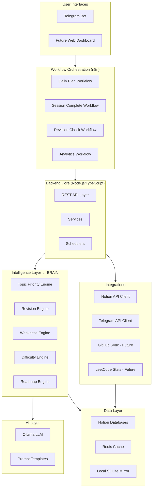
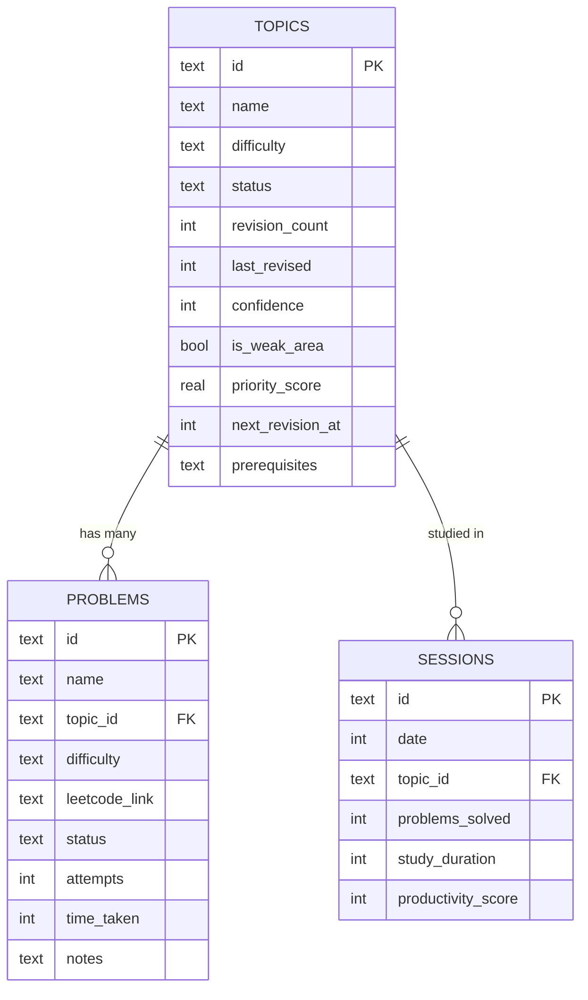
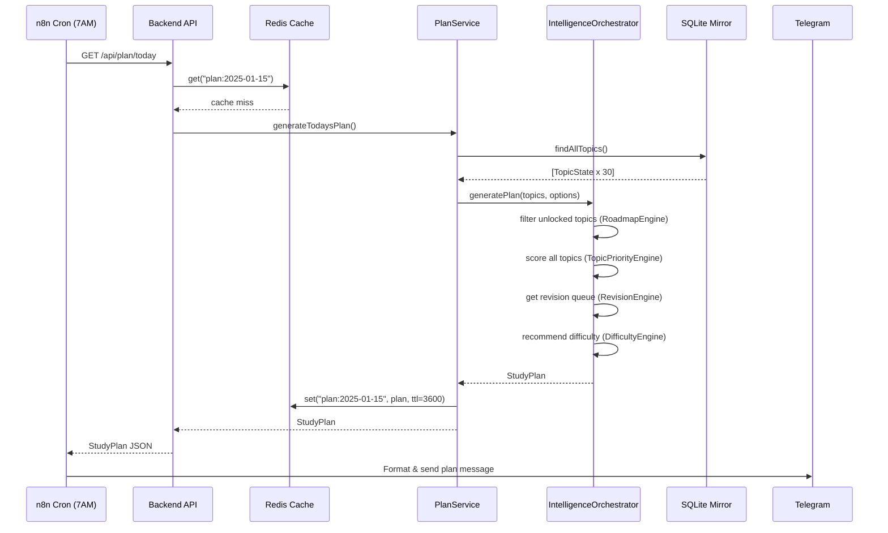
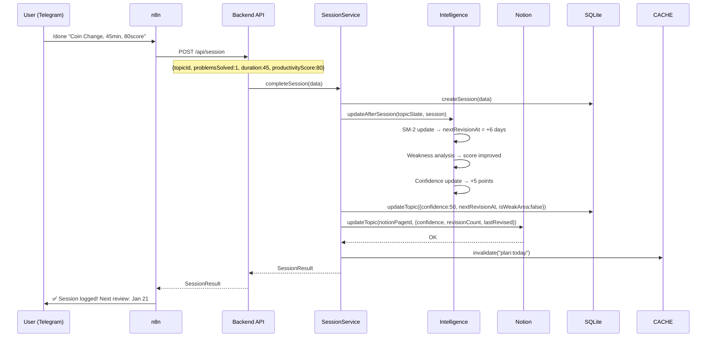

# DSA Mastery OS — Comprehensive Implementation Plan

> **Executive Summary**  
> DSA Mastery OS is not a tracker — it is an autonomous learning intelligence layer over your Notion databases, powered by local AI (Ollama), automated via n8n, and delivered through Telegram. The system's competitive advantage is its **Intelligence Layer**: five engines that work together to understand your learning state, schedule optimally, and adapt in real-time. This plan is organized into six phases spanning roughly 20–24 weeks of active development. The first four weeks are non-negotiable: they lay the intelligence foundation that everything else depends on. Start there. Ship the rest iteratively.

---

## Table of Contents

1. [Architecture Overview](#1-architecture-overview)
2. [Tech Stack Decisions](#2-tech-stack-decisions)
3. [Phase Roadmap](#3-phase-roadmap)
4. [Layer-by-Layer Breakdown](#4-layer-by-layer-breakdown)
5. [Intelligence Layer Deep Dive](#5-intelligence-layer-deep-dive)
6. [Daily Workflow Examples (End-to-End Flows)](#6-daily-workflow-examples)
7. [Risks & Mitigation](#7-risks--mitigation)
8. [Immediate 14-Day Action Plan](#8-immediate-14-day-action-plan)

---

## 1. Architecture Overview



### Data Flow Philosophy

```
User Action → n8n Workflow (thin) → Backend API → Intelligence Engines
           → Notion API (via Integration Layer) → Cache Invalidation
           → Response aggregated → Telegram/Dashboard
```

**Key Principle**: n8n is an **orchestrator only** (triggers, routing, formatting). All business logic lives in the Backend + Intelligence layers. This ensures your system is testable, portable, and not locked into n8n.

---

## 2. Tech Stack Decisions

| Concern | Choice | Rationale |
|---|---|---|
| **Language** | TypeScript (Node.js 20+) | Strong typing for complex engine logic; massive ecosystem |
| **Runtime** | Node.js 20 LTS | Stable, bun-compatible if needed later |
| **Framework** | Fastify (not Express) | 2–3× faster, native TypeScript, schema validation built-in |
| **ORM / DB Access** | Drizzle ORM + direct Notion SDK | Drizzle for local SQLite mirror; Notion SDK for source of truth |
| **Local DB (Mirror)** | SQLite (via better-sqlite3) | Zero-config, embedded, fast reads for intelligence engines |
| **Cache** | Redis (via ioredis) | Session cache, score cache, rate limit buffer |
| **AI / LLM** | Ollama (llama3.1:8b or mistral:7b) | Local-first, no API costs, privacy |
| **Workflow Automation** | n8n (self-hosted via Docker) | Visual orchestration, Notion + Telegram nodes built-in |
| **Queue** | BullMQ (backed by Redis) | Reliable job scheduling for intelligence computation |
| **Containerization** | Docker + Docker Compose | Single-command boot, environment parity |
| **Testing** | Vitest + Supertest | Fast, ESM-native, great TypeScript support |
| **Logging** | Pino | Structured JSON logging, extremely fast |
| **Monitoring** | Grafana + Prometheus (optional Phase 5) | Observable system health |

### Future Migration Path: Notion → PostgreSQL

```
Phase 1-3: Notion as source of truth, SQLite as read mirror
Phase 4+:  Introduce PostgreSQL as primary DB
           Notion becomes a "view layer" synced by a one-way writer
           Drizzle ORM handles both SQLite and PostgreSQL (same query API)
Migration: 1 script, 1 weekend, zero intelligence-layer changes
```

---

## 3. Phase Roadmap

### Phase Overview

```
Phase 0: Foundation          Week 1–2     Infrastructure + Skeleton
Phase 1: Intelligence Core   Week 3–6     Five engines, scoring, spaced rep
Phase 2: Backend + APIs      Week 5–8     REST API, services, Notion sync
Phase 3: Workflows + Bot     Week 7–10    n8n workflows, Telegram commands
Phase 4: Analytics           Week 11–14   Dashboards, reports, trend analysis
Phase 5: Advanced AI         Week 15–20   LLM coaching, adaptive hints, GitHub sync
Phase 6: Web Dashboard       Week 18–24   React frontend, visualization
```

---

### Phase 0: Foundation (Week 1–2)

**Goal**: A working skeleton where every layer exists and can communicate. No features yet — just pipes and plumbing.

**Deliverables**:
- `docker-compose.yml` running n8n, Redis, Ollama
- TypeScript monorepo initialized (pnpm workspaces)
- Notion API client working, can read all three databases
- SQLite mirror schema created and syncing
- Basic health check endpoint
- Environment config system (`.env` per service)
- CI/CD pipeline (GitHub Actions: lint + test on push)

**Tech**:
```
pnpm workspaces
packages/
  backend/     → Fastify app
  intelligence/  → Engines (pure TS, no framework)
  integrations/  → Notion, Telegram clients
  shared/       → Types, constants, utils
```

**Estimated Effort**: 8–12 hours

**Success Criteria**:
- [ ] `docker compose up` brings the entire stack live
- [ ] `GET /health` returns 200 with Notion connectivity status
- [ ] SQLite mirror has all Topics/Problems/Sessions loaded

---

### Phase 1: Intelligence Core (Week 3–6)

**Goal**: Build all five intelligence engines. This is the heart of the system. Everything else serves these engines.

**Deliverables**:
- `TopicPriorityEngine` with scoring formula
- `RevisionEngine` with SM-2 spaced repetition
- `WeaknessEngine` with multi-signal detection
- `DifficultyEngine` with adaptive progression
- `RoadmapEngine` with DAG prerequisite enforcement
- Unit tests for all engines (target: 90%+ coverage)
- Intelligence state snapshot (what the system "knows" about you)

**Estimated Effort**: 25–35 hours

**Success Criteria**:
- [ ] Engine scores are deterministic and explainable
- [ ] Given sample data, `generateDailyPlan()` returns a ranked topic list
- [ ] `getRevisionQueue()` returns topics overdue for review
- [ ] Prerequisite violations are detected and reported

---

### Phase 2: Backend + APIs (Week 5–8)

**Goal**: REST API layer that exposes intelligence as actionable endpoints. Notion sync service. Job scheduling.

**Deliverables**:
- `/api/plan/today` — generate daily study plan
- `/api/session` — CRUD for sessions
- `/api/topics` — read/update topics with scores
- `/api/revision` — get revision queue
- `/api/analytics/summary` — weekly stats
- Notion sync service (bidirectional, conflict-aware)
- BullMQ schedulers: daily plan at 7 AM, revision check at 9 PM

**Estimated Effort**: 20–25 hours

**Success Criteria**:
- [ ] All endpoints return in <500ms (from cache) or <2s (fresh)
- [ ] Notion sync handles rate limits gracefully
- [ ] Scheduled jobs fire reliably

---

### Phase 3: Workflows + Telegram Bot (Week 7–10)

**Goal**: n8n workflows that make the system feel alive. Telegram commands for quick actions.

**Deliverables**:
- n8n: Daily Plan workflow (7 AM trigger → API → Telegram)
- n8n: Session Complete workflow (Telegram input → API → Notion update)
- n8n: Revision Reminder workflow (9 PM conditional alert)
- Telegram commands: `/plan`, `/done <problem>`, `/progress`, `/hint`
- Ollama integration for `/hint` command (LLM explanation)

**Estimated Effort**: 15–20 hours

**Success Criteria**:
- [ ] Full morning flow works end-to-end via Telegram
- [ ] Session logging takes <30 seconds via Telegram
- [ ] Ollama hints are contextually relevant

---

### Phase 4: Analytics (Week 11–14)

**Goal**: Surface patterns and insights. Make progress visible.

**Deliverables**:
- Weekly email/Telegram digest
- Streak tracking
- Topic mastery velocity chart
- Weakness trend over time
- Comparative difficulty analysis

**Estimated Effort**: 15–20 hours

---

### Phase 5: Advanced AI + External Sync (Week 15–20)

**Goal**: Richer AI coaching, LeetCode integration, GitHub problem sync.

**Deliverables**:
- LLM-powered session debrief ("You struggled with graph traversal 3x this week. Here's why...")
- LeetCode stats API integration
- GitHub repo sync (solutions stored alongside problems)
- Adaptive hint generation per difficulty level

**Estimated Effort**: 25–30 hours

---

### Phase 6: Web Dashboard (Week 18–24)

**Goal**: Visual command center. Rich charts, calendar view, knowledge graph.

**Deliverables**:
- React + Vite frontend
- D3.js knowledge graph visualization (topics as nodes, mastery as color)
- Calendar heat map (LeetCode-style)
- Real-time session tracker

**Estimated Effort**: 30–40 hours

---

## 4. Layer-by-Layer Breakdown

### 4.1 `infrastructure/`

**Purpose**: All Docker, environment, and networking concerns.

```
infrastructure/
├── docker-compose.yml         # Orchestrates all services
├── docker-compose.dev.yml     # Dev overrides (volumes, hot reload)
├── .env.example               # Template for all required vars
├── nginx/
│   └── nginx.conf             # Reverse proxy (Phase 6+)
└── scripts/
    ├── setup.sh               # First-time setup script
    ├── seed.sh                # Seed SQLite from Notion
    └── health-check.sh        # Verify all services alive
```

**docker-compose.yml (key services)**:
```yaml
services:
  backend:
    build: ./packages/backend
    ports: ["3000:3000"]
    depends_on: [redis, ollama]
    volumes:
      - ./data/sqlite:/app/data

  redis:
    image: redis:7-alpine
    ports: ["6379:6379"]

  ollama:
    image: ollama/ollama:latest
    volumes:
      - ollama_models:/root/.ollama
    ports: ["11434:11434"]

  n8n:
    image: n8nio/n8n:latest
    ports: ["5678:5678"]
    environment:
      - N8N_BASIC_AUTH_ACTIVE=true
    volumes:
      - n8n_data:/home/node/.n8n
```

**Extensibility**: Add `pgdb` service block when migrating to PostgreSQL. Zero other changes needed.

---

### 4.2 `database/`

**Purpose**: Schema definitions, migration files, ER diagrams, seed scripts.

```
database/
├── schema/
│   ├── sqlite.schema.ts       # Drizzle schema (mirror of Notion)
│   └── notion-types.ts        # TypeScript types matching Notion DB structure
├── migrations/
│   └── 0001_initial.sql
├── seeds/
│   └── from-notion.ts         # Pull from Notion → seed SQLite
└── diagrams/
    └── ER.mermaid
```

**SQLite Mirror Schema** (Drizzle):
```typescript
// database/schema/sqlite.schema.ts
import { sqliteTable, text, integer, real } from 'drizzle-orm/sqlite-core';

export const topics = sqliteTable('topics', {
  id: text('id').primaryKey(),                    // Notion page ID
  name: text('name').notNull(),
  difficulty: text('difficulty'),                 // Easy | Medium | Hard
  status: text('status').default('Not started'),  // Not started | In progress | Mastered
  revisionCount: integer('revision_count').default(0),
  lastRevised: integer('last_revised'),           // Unix timestamp
  confidence: integer('confidence').default(0),  // 0–100
  isWeakArea: integer('is_weak_area').default(0), // Boolean
  // Computed by Intelligence Layer — not in Notion
  priorityScore: real('priority_score'),
  nextRevisionAt: integer('next_revision_at'),
  prerequisites: text('prerequisites'),           // JSON array of topic IDs
  updatedAt: integer('updated_at').notNull(),
});

export const problems = sqliteTable('problems', {
  id: text('id').primaryKey(),
  name: text('name').notNull(),
  topicId: text('topic_id').references(() => topics.id),
  difficulty: text('difficulty'),
  leetcodeLink: text('leetcode_link'),
  status: text('status').default('Unsolved'),
  attempts: integer('attempts').default(0),
  timeTaken: integer('time_taken'),               // Minutes
  notes: text('notes'),
  updatedAt: integer('updated_at').notNull(),
});

export const sessions = sqliteTable('sessions', {
  id: text('id').primaryKey(),
  date: integer('date').notNull(),
  topicId: text('topic_id').references(() => topics.id),
  problemsSolved: integer('problems_solved').default(0),
  studyDuration: integer('study_duration'),       // Minutes
  productivityScore: integer('productivity_score'),
  updatedAt: integer('updated_at').notNull(),
});
```

**ER Diagram**:


---

### 4.3 `intelligence/` ← Most Important Layer

See **Section 5** for deep dive. High-level structure:

```
intelligence/
├── index.ts                        # Public API: IntelligenceOrchestrator
├── types.ts                        # Shared intelligence types/interfaces
├── topic-priority-engine/
│   ├── TopicPriorityEngine.ts
│   ├── scoring.ts                  # Pure scoring formulas
│   └── TopicPriorityEngine.test.ts
├── revision-engine/
│   ├── RevisionEngine.ts
│   ├── sm2.ts                      # SM-2 algorithm implementation
│   └── RevisionEngine.test.ts
├── weakness-engine/
│   ├── WeaknessEngine.ts
│   ├── signals.ts                  # Signal extractors
│   └── WeaknessEngine.test.ts
├── difficulty-engine/
│   ├── DifficultyEngine.ts
│   └── DifficultyEngine.test.ts
└── roadmap-engine/
    ├── RoadmapEngine.ts
    ├── dag.ts                      # DAG traversal utilities
    └── RoadmapEngine.test.ts
```

---

### 4.4 `backend/`

**Purpose**: Application logic, REST API, repositories, scheduled jobs.

```
backend/
├── app.ts                     # Fastify app factory
├── server.ts                  # Entry point
├── api/
│   ├── plan.routes.ts         # /api/plan/*
│   ├── session.routes.ts      # /api/session/*
│   ├── topics.routes.ts       # /api/topics/*
│   ├── revision.routes.ts     # /api/revision/*
│   └── analytics.routes.ts    # /api/analytics/*
├── services/
│   ├── PlanService.ts         # Orchestrates intelligence → plan
│   ├── SessionService.ts      # Session CRUD + triggers intelligence update
│   ├── NotionSyncService.ts   # Bidirectional Notion ↔ SQLite sync
│   └── AnalyticsService.ts
├── repositories/
│   ├── TopicRepository.ts     # Drizzle queries for topics
│   ├── ProblemRepository.ts
│   └── SessionRepository.ts
└── schedulers/
    ├── DailyPlanScheduler.ts  # Cron: 7 AM → generate plan
    ├── RevisionScheduler.ts   # Cron: 9 PM → check revision queue
    └── SyncScheduler.ts       # Cron: every 30 min → sync Notion
```

**Service Layer Pattern**:
```typescript
// backend/services/PlanService.ts
export class PlanService {
  constructor(
    private readonly intelligence: IntelligenceOrchestrator,
    private readonly topicRepo: TopicRepository,
    private readonly cache: CacheService,
  ) {}

  async generateTodaysPlan(options: PlanOptions): Promise<StudyPlan> {
    const cacheKey = `plan:${formatDate(new Date())}`;
    const cached = await this.cache.get<StudyPlan>(cacheKey);
    if (cached) return cached;

    const allTopics = await this.topicRepo.findAll();
    const plan = await this.intelligence.generatePlan(allTopics, options);

    await this.cache.set(cacheKey, plan, { ttl: 3600 }); // 1 hour TTL
    return plan;
  }
}
```

---

### 4.5 `ai/`

**Purpose**: All LLM interaction — prompts, model management, response parsing.

```
ai/
├── llm/
│   ├── OllamaClient.ts        # HTTP client wrapping Ollama API
│   ├── LLMService.ts          # High-level: generate, embed, chat
│   └── models.ts              # Model registry (llama3.1, mistral, etc.)
└── prompts/
    ├── hint.prompt.ts         # "Explain this DSA concept..."
    ├── debrief.prompt.ts      # "Analyze this study session..."
    ├── weakness.prompt.ts     # "Based on these errors, identify gaps..."
    └── types.ts               # PromptTemplate type
```

**Prompt Template Pattern**:
```typescript
// ai/prompts/hint.prompt.ts
export const hintPrompt = (ctx: HintContext): string => `
You are a DSA tutor helping a developer master algorithms.

Problem: ${ctx.problemName}
Topic: ${ctx.topicName}
Difficulty: ${ctx.difficulty}
Student's current confidence: ${ctx.confidence}/100
Previous attempts: ${ctx.attempts}

Provide a targeted hint that:
1. Does NOT give away the solution
2. Points toward the right pattern/approach
3. Is calibrated to difficulty (${ctx.difficulty})
4. References the underlying ${ctx.topicName} concept

Keep it under 150 words.
`;
```

---

### 4.6 `workflows/`

**Purpose**: n8n workflow JSON exports. Thin orchestration only — no business logic.

```
workflows/
├── daily-plan.workflow.json       # 7 AM → GET /api/plan/today → Telegram
├── session-complete.workflow.json # Telegram input → POST /api/session → Notion
├── revision-check.workflow.json   # 9 PM → GET /api/revision → conditional Telegram
├── weekly-digest.workflow.json    # Sunday 8 PM → GET /api/analytics/summary
└── README.md                      # Import instructions for n8n
```

**n8n Design Rule**: Every workflow has **at most 3 steps**:
1. Trigger (Cron / Webhook / Telegram)
2. HTTP Request to Backend API
3. Output (Telegram / Notion node)

All complexity lives in the Backend. n8n just wires things together.

---

### 4.7 `integrations/`

**Purpose**: Isolated clients for external services. One class per integration.

```
integrations/
├── notion/
│   ├── NotionClient.ts        # Wraps @notionhq/client SDK
│   ├── TopicsNotionRepo.ts    # Notion-specific query methods
│   ├── ProblemsNotionRepo.ts
│   └── SessionsNotionRepo.ts
├── telegram/
│   ├── TelegramClient.ts      # Wraps node-telegram-bot-api
│   ├── commands/
│   │   ├── plan.command.ts    # /plan handler
│   │   ├── done.command.ts    # /done <problem> handler
│   │   ├── hint.command.ts    # /hint handler → LLM
│   │   └── progress.command.ts
│   └── formatters/
│       ├── plan.formatter.ts  # StudyPlan → Telegram markdown
│       └── progress.formatter.ts
├── github/                    # Phase 5
│   └── GitHubClient.ts
└── leetcode/                  # Phase 5
    └── LeetCodeScraper.ts
```

**Notion Rate Limit Handling**:
```typescript
// integrations/notion/NotionClient.ts
export class NotionClient {
  private requestQueue: PQueue;

  constructor(private client: Client) {
    // Notion allows 3 requests/second
    this.requestQueue = new PQueue({ intervalCap: 3, interval: 1000 });
  }

  async queryDatabase(databaseId: string, filter?: QueryDatabaseParameters['filter']) {
    return this.requestQueue.add(() =>
      retry(() => this.client.databases.query({ database_id: databaseId, filter }), {
        retries: 3,
        onRetry: (err, attempt) => logger.warn({ err, attempt }, 'Retrying Notion request'),
      })
    );
  }
}
```

---

### 4.8 `analytics/`

```
analytics/
├── AnalyticsEngine.ts         # Compute streaks, velocity, trends
├── reports/
│   ├── WeeklyReport.ts        # Weekly digest generator
│   └── MasteryReport.ts       # Per-topic mastery over time
└── metrics/
    ├── streak.ts
    ├── velocity.ts             # Problems/hour trend
    └── mastery-rate.ts
```

---

## 5. Intelligence Layer Deep Dive

> This layer is stateless: it receives data, computes scores, returns decisions. It has zero I/O — no database calls, no HTTP requests. Pure computation. This makes it blazing fast and perfectly testable.

### 5.1 Shared Types

```typescript
// intelligence/types.ts

export interface TopicState {
  id: string;
  name: string;
  difficulty: 'Easy' | 'Medium' | 'Hard';
  status: 'Not started' | 'In progress' | 'Mastered';
  confidence: number;          // 0–100
  revisionCount: number;
  lastRevised: Date | null;
  isWeakArea: boolean;
  problemsSolved: number;
  totalAttempts: number;
  averageTimeTaken: number;    // minutes per problem
  prerequisites: string[];     // topic IDs
  recentSessions: SessionSnapshot[];
}

export interface SessionSnapshot {
  date: Date;
  problemsSolved: number;
  productivityScore: number;
  duration: number;
}

export interface PriorityScore {
  topicId: string;
  total: number;               // 0–100 composite
  breakdown: {
    urgency: number;           // Spaced rep due date
    weakness: number;          // Weak area signals
    confidence: number;        // Inverted confidence
    prerequisiteReady: number; // Prerequisites satisfied?
    recency: number;           // How long since studied
    difficulty: number;        // Difficulty-adjusted weight
  };
  recommendation: 'Study now' | 'Review soon' | 'Practice more' | 'Maintain';
}

export interface StudyPlan {
  date: Date;
  primaryTopic: TopicState;
  revisionTopics: TopicState[];
  suggestedProblems: ProblemSuggestion[];
  estimatedDuration: number;  // minutes
  reasoning: string;           // Human-readable explanation
}
```

---

### 5.2 Topic Priority Engine

**Responsibility**: Rank every topic by a composite score to determine what to study next.

**Scoring Formula**:

```
PriorityScore = W₁·Urgency + W₂·WeaknessScore + W₃·ConfidenceGap + W₄·PrereqBonus + W₅·RecencyScore

Weights (tunable in config):
  W₁ = 0.30  (Urgency — is spaced rep due?)
  W₂ = 0.25  (Weakness signals — failing, slow, retrying)
  W₃ = 0.20  (Confidence gap — lower confidence = higher priority)
  W₄ = 0.15  (Prerequisites — topic is unlocked and ready)
  W₅ = 0.10  (Recency — hasn't been touched in a while)
```

**Component Formulas**:

```typescript
// intelligence/topic-priority-engine/scoring.ts

/** How urgently does spaced repetition demand this topic? (0–1) */
export function urgencyScore(topic: TopicState, now: Date): number {
  if (!topic.lastRevised) return 1.0; // Never studied = maximum urgency
  const daysOverdue = differenceInDays(now, topic.nextRevisionAt);
  if (daysOverdue <= 0) return 0;
  return Math.min(1, daysOverdue / 14); // Saturates at 14 days overdue
}

/** How weak is the student on this topic? (0–1) */
export function weaknessScore(topic: TopicState): number {
  const signals = [
    topic.isWeakArea ? 0.4 : 0,
    topic.confidence < 40 ? 0.3 : topic.confidence < 60 ? 0.1 : 0,
    topic.totalAttempts > 0 && (topic.problemsSolved / topic.totalAttempts) < 0.5 ? 0.2 : 0,
    topic.averageTimeTaken > 45 ? 0.1 : 0, // Slow on problems
  ];
  return Math.min(1, signals.reduce((a, b) => a + b, 0));
}

/** How large is the confidence gap? (0–1) */
export function confidenceGapScore(topic: TopicState): number {
  return (100 - topic.confidence) / 100;
}

/** Are all prerequisites mastered? Bonus for "just unlocked" topics */
export function prerequisiteBonus(
  topic: TopicState,
  allTopics: Map<string, TopicState>
): number {
  if (topic.prerequisites.length === 0) return 0.5; // Foundational topic
  const prereqsMastered = topic.prerequisites.every(
    (id) => allTopics.get(id)?.status === 'Mastered'
  );
  return prereqsMastered ? 1.0 : 0; // Block completely if prereqs not met
}

/** How long since last studied? (0–1) */
export function recencyScore(topic: TopicState, now: Date): number {
  if (!topic.lastRevised) return 1.0;
  const daysSince = differenceInDays(now, topic.lastRevised);
  return Math.min(1, daysSince / 30);
}

/** Composite scorer */
export function computePriorityScore(
  topic: TopicState,
  allTopics: Map<string, TopicState>,
  weights = DEFAULT_WEIGHTS,
  now = new Date()
): PriorityScore {
  const breakdown = {
    urgency:         urgencyScore(topic, now),
    weakness:        weaknessScore(topic),
    confidence:      confidenceGapScore(topic),
    prerequisiteReady: prerequisiteBonus(topic, allTopics),
    recency:         recencyScore(topic, now),
    difficulty:      difficultyWeight(topic.difficulty),
  };

  const total = (
    weights.urgency         * breakdown.urgency         +
    weights.weakness        * breakdown.weakness        +
    weights.confidence      * breakdown.confidence      +
    weights.prerequisite    * breakdown.prerequisiteReady +
    weights.recency         * breakdown.recency
  ) * breakdown.difficulty * 100;

  return { topicId: topic.id, total: Math.min(100, total), breakdown, recommendation: classifyRecommendation(breakdown) };
}
```

**Daily Plan Generation**:
```typescript
// intelligence/topic-priority-engine/TopicPriorityEngine.ts
export class TopicPriorityEngine {
  generatePlan(topics: TopicState[], options: PlanOptions): StudyPlan {
    const allTopicsMap = new Map(topics.map(t => [t.id, t]));

    const scored = topics
      .filter(t => t.status !== 'Mastered' || this.revisionEngine.isDue(t))
      .map(t => ({ topic: t, score: computePriorityScore(t, allTopicsMap) }))
      .sort((a, b) => b.score.total - a.score.total);

    const [primary, ...rest] = scored;
    const revisionTopics = rest
      .filter(s => s.score.breakdown.urgency > 0.5)
      .slice(0, options.maxRevisionTopics ?? 2)
      .map(s => s.topic);

    return {
      date: new Date(),
      primaryTopic: primary.topic,
      revisionTopics,
      suggestedProblems: this.selectProblems(primary.topic, options),
      estimatedDuration: this.estimateDuration(primary.topic, revisionTopics),
      reasoning: this.explainPlan(primary, revisionTopics),
    };
  }
}
```

---

### 5.3 Revision Engine (SM-2 Spaced Repetition)

**Algorithm**: Modified SM-2 (SuperMemo 2), widely proven for technical learning.

```typescript
// intelligence/revision-engine/sm2.ts

export interface SM2State {
  interval: number;      // Days until next review
  repetition: number;    // Review count
  efactor: number;       // Ease factor (starts at 2.5)
  nextRevisionAt: Date;
}

/**
 * SM-2 Algorithm
 * quality: 0–5 (0=blackout, 3=correct after hesitation, 5=perfect)
 */
export function sm2Update(state: SM2State, quality: number): SM2State {
  // New or failed: reset
  if (quality < 3) {
    return {
      ...state,
      interval: 1,
      repetition: 0,
      efactor: Math.max(1.3, state.efactor - 0.2),
      nextRevisionAt: addDays(new Date(), 1),
    };
  }

  // Update ease factor
  const newEfactor = Math.max(
    1.3,
    state.efactor + (0.1 - (5 - quality) * (0.08 + (5 - quality) * 0.02))
  );

  // Calculate next interval
  let newInterval: number;
  if (state.repetition === 0) newInterval = 1;
  else if (state.repetition === 1) newInterval = 6;
  else newInterval = Math.round(state.interval * newEfactor);

  return {
    interval: newInterval,
    repetition: state.repetition + 1,
    efactor: newEfactor,
    nextRevisionAt: addDays(new Date(), newInterval),
  };
}

/** Map topic signals to SM-2 quality score */
export function topicToSM2Quality(topic: TopicState, session: SessionSnapshot): number {
  const productivityNorm = session.productivityScore / 100;
  if (productivityNorm < 0.3) return 1;  // Blackout
  if (productivityNorm < 0.5) return 2;  // Incorrect, remembered
  if (productivityNorm < 0.65) return 3; // Correct with difficulty
  if (productivityNorm < 0.8) return 4;  // Correct with hesitation
  return 5;                               // Perfect
}
```

**RevisionEngine**:
```typescript
export class RevisionEngine {
  isDue(topic: TopicState): boolean {
    if (!topic.nextRevisionAt) return true;
    return isBefore(topic.nextRevisionAt, new Date());
  }

  getRevisionQueue(topics: TopicState[]): TopicState[] {
    return topics
      .filter(t => t.status !== 'Not started' && this.isDue(t))
      .sort((a, b) =>
        differenceInDays(new Date(), b.nextRevisionAt!) -
        differenceInDays(new Date(), a.nextRevisionAt!)
      );
  }

  updateAfterSession(topic: TopicState, session: SessionSnapshot): SM2State {
    const quality = topicToSM2Quality(topic, session);
    const currentState: SM2State = {
      interval: topic.revisionCount || 1,
      repetition: topic.revisionCount,
      efactor: this.computeEfactor(topic),
      nextRevisionAt: topic.lastRevised || new Date(),
    };
    return sm2Update(currentState, quality);
  }
}
```

---

### 5.4 Weakness Engine

**Responsibility**: Detect weak areas using multi-signal analysis. Mark topics proactively.

**Signals** (weighted sum → weakness score):

| Signal | Weight | Description |
|---|---|---|
| Low confidence | 0.30 | Confidence < 50 |
| High retry rate | 0.25 | Attempts/solved > 2.5 |
| Slow solution time | 0.15 | avg time > 45 min |
| Low productivity in sessions | 0.15 | avg score < 60 |
| Multiple failures in revision | 0.15 | SM-2 quality < 3 repeatedly |

```typescript
// intelligence/weakness-engine/WeaknessEngine.ts
export class WeaknessEngine {
  analyzeWeakness(topic: TopicState): WeaknessAnalysis {
    const signals: WeaknessSignal[] = [
      this.confidenceSignal(topic),
      this.retryRateSignal(topic),
      this.timeSignal(topic),
      this.sessionProductivitySignal(topic),
      this.revisionFailureSignal(topic),
    ];

    const score = signals.reduce((acc, s) => acc + s.weight * s.value, 0);
    const isWeak = score > 0.45; // Threshold (tunable)

    return {
      topicId: topic.id,
      score,
      isWeak,
      signals: signals.filter(s => s.value > 0),
      recommendation: this.buildRecommendation(signals),
    };
  }

  detectAllWeaknesses(topics: TopicState[]): WeaknessReport {
    const analyses = topics.map(t => this.analyzeWeakness(t));
    return {
      weakTopics: analyses.filter(a => a.isWeak),
      strongTopics: analyses.filter(a => !a.isWeak && a.score < 0.2),
      summary: this.summarize(analyses),
    };
  }
}
```

---

### 5.5 Difficulty Engine

**Responsibility**: Adapt problem difficulty selection based on current performance.

**Adaptation Logic**:
```
IF confidence >= 80 AND last 3 sessions have productivityScore > 75:
    → Recommend Hard problems
ELSE IF confidence >= 60 AND productivityScore > 60:
    → Recommend Medium problems
ELSE IF confidence >= 40:
    → Mix Easy/Medium (70/30)
ELSE:
    → Easy problems only + conceptual review
```

```typescript
// intelligence/difficulty-engine/DifficultyEngine.ts
export class DifficultyEngine {
  recommendDifficulty(topic: TopicState): DifficultyRecommendation {
    const recentAvgProductivity = this.computeRecentProductivity(topic.recentSessions, 3);
    const { confidence } = topic;

    if (confidence >= 80 && recentAvgProductivity >= 75) {
      return { primary: 'Hard', secondary: 'Medium', ratio: [0.7, 0.3] };
    }
    if (confidence >= 60 && recentAvgProductivity >= 60) {
      return { primary: 'Medium', secondary: 'Hard', ratio: [0.8, 0.2] };
    }
    if (confidence >= 40) {
      return { primary: 'Easy', secondary: 'Medium', ratio: [0.7, 0.3] };
    }
    return { primary: 'Easy', secondary: null, ratio: [1.0, 0] };
  }

  private computeRecentProductivity(sessions: SessionSnapshot[], n: number): number {
    const recent = sessions.slice(-n);
    if (recent.length === 0) return 50; // Default for new topics
    return recent.reduce((acc, s) => acc + s.productivityScore, 0) / recent.length;
  }
}
```

---

### 5.6 Roadmap Engine (DAG)

**Responsibility**: Enforce prerequisite ordering. Never recommend a topic whose prerequisites are not met.

```typescript
// intelligence/roadmap-engine/dag.ts

/** Directed Acyclic Graph of topic prerequisites */
export class TopicDAG {
  private graph: Map<string, Set<string>> = new Map();

  addEdge(from: string, to: string) {
    // from must be mastered before to can be studied
    if (!this.graph.has(from)) this.graph.set(from, new Set());
    this.graph.get(from)!.add(to);
  }

  /** Get all prerequisites for a topic (transitive) */
  getAllPrerequisites(topicId: string): string[] {
    const visited = new Set<string>();
    const traverse = (id: string) => {
      for (const [prereq, targets] of this.graph) {
        if (targets.has(id) && !visited.has(prereq)) {
          visited.add(prereq);
          traverse(prereq);
        }
      }
    };
    traverse(topicId);
    return [...visited];
  }

  /** Is a topic unlocked? All prerequisites mastered? */
  isUnlocked(topicId: string, masteredTopics: Set<string>): boolean {
    const prereqs = this.getAllPrerequisites(topicId);
    return prereqs.every(p => masteredTopics.has(p));
  }

  /** Detect cycles (validation) */
  hasCycle(): boolean {
    const visited = new Set<string>();
    const recStack = new Set<string>();

    const dfs = (node: string): boolean => {
      visited.add(node);
      recStack.add(node);
      for (const neighbor of this.graph.get(node) ?? []) {
        if (!visited.has(neighbor) && dfs(neighbor)) return true;
        if (recStack.has(neighbor)) return true;
      }
      recStack.delete(node);
      return false;
    };

    for (const node of this.graph.keys()) {
      if (!visited.has(node) && dfs(node)) return true;
    }
    return false;
  }
}
```

**Predefined DSA Prerequisite Map**:
```typescript
// intelligence/roadmap-engine/dsa-roadmap.ts
export const DSA_PREREQUISITES: [string, string][] = [
  // [prerequisite, topic]
  ['Arrays', 'Two Pointers'],
  ['Arrays', 'Sliding Window'],
  ['Arrays', 'Binary Search'],
  ['Linked Lists', 'Fast & Slow Pointers'],
  ['Stacks', 'Monotonic Stack'],
  ['Trees', 'Tree DFS'],
  ['Trees', 'Tree BFS'],
  ['Trees', 'Binary Search Tree'],
  ['Binary Search Tree', 'AVL Trees'],
  ['Graphs', 'Graph DFS'],
  ['Graphs', 'Graph BFS'],
  ['Graph BFS', "Dijkstra's Algorithm"],
  ['Graph DFS', 'Topological Sort'],
  ['Recursion', 'Dynamic Programming'],
  ['Dynamic Programming', 'DP on Trees'],
];
```

---

### 5.7 Intelligence Orchestrator

The public API that all backend services call:

```typescript
// intelligence/index.ts
export class IntelligenceOrchestrator {
  constructor(
    private topicPriority: TopicPriorityEngine,
    private revision: RevisionEngine,
    private weakness: WeaknessEngine,
    private difficulty: DifficultyEngine,
    private roadmap: RoadmapEngine,
  ) {}

  generatePlan(topics: TopicState[], options: PlanOptions): StudyPlan {
    const unlocked = topics.filter(t => this.roadmap.isUnlocked(t));
    const withScores = this.topicPriority.scoreAll(unlocked);
    const difficultyRec = this.difficulty.recommendDifficulty(withScores[0].topic);
    return this.topicPriority.buildPlan(withScores, difficultyRec, options);
  }

  updateAfterSession(topic: TopicState, session: SessionSnapshot): IntelligenceUpdate {
    const sm2 = this.revision.updateAfterSession(topic, session);
    const weaknessUpdate = this.weakness.analyzeWeakness({ ...topic, recentSessions: [...topic.recentSessions, session] });
    return { sm2, weaknessUpdate };
  }

  getRevisionQueue(topics: TopicState[]): TopicState[] {
    return this.revision.getRevisionQueue(topics);
  }

  getWeaknessReport(topics: TopicState[]): WeaknessReport {
    return this.weakness.detectAllWeaknesses(topics);
  }
}
```

---

## 6. Daily Workflow Examples

### Flow 1: "Generate Today's Study Plan" (7 AM)



**Telegram Output**:
```
🧠 DSA Study Plan — Tuesday, Jan 15

📚 PRIMARY: Dynamic Programming (Score: 87/100)
  Reason: 8 days overdue for revision, confidence at 45%
  🎯 Recommended: 2 Medium problems
  ⏱ Est. time: 90 min

🔄 REVISION (2 topics):
  • Binary Search (due 3 days ago)
  • Two Pointers (due today)
  ⏱ Est. time: 30 min

📋 Today's Problems:
  1. Coin Change (Medium) — LeetCode #322
  2. Longest Increasing Subsequence (Medium) — LC #300

Total estimated time: ~2 hours
Type /hint <problem_name> for a hint anytime.
```

---

### Flow 2: "Complete Session → Update Intelligence State"



---

### Flow 3: "Evening Revision Check" (9 PM)

```
n8n Cron (9 PM)
  → GET /api/revision
  → Backend: RevisionEngine.getRevisionQueue(allTopics)
  → Filter: topics where nextRevisionAt < now + 24h
  → IF queue.length > 0:
      → Telegram: "📅 3 topics due for revision tomorrow: Arrays, Binary Search, Stacks"
  → ELSE:
      → No notification sent
```

---

## 7. Risks & Mitigation

| Risk | Severity | Probability | Mitigation |
|---|---|---|---|
| **Notion API rate limits** (3 req/s) | High | High | Request queue with PQueue, local SQLite mirror as primary read layer, batch writes |
| **Ollama latency** (cold start 3–8s) | Medium | High | Keep model warm with `/api/health` ping every 5 min; stream responses to Telegram |
| **Cold start intelligence** (no data yet) | High | Certain (Day 1) | Bootstrap defaults: all topics start at confidence=30, isWeakArea=false; system learns fast |
| **SQLite sync conflicts** | Medium | Medium | Notion is source of truth; SQLite is read-only mirror; one-way sync with timestamp conflict resolution |
| **n8n workflow drift** | Low | Medium | Version control all workflows as JSON; document every node; keep workflows thin |
| **Scoring formula miscalibration** | Medium | High | Make all weights configurable via `.env`; build a "explain score" endpoint; review weekly |
| **Prerequisite DAG cycle** | Low | Low | Validate DAG at startup; throw hard error if cycle detected; provide fix instructions |
| **Telegram bot downtime** | Low | Low | Backend API is primary; Telegram is just UI; system still runs without it |
| **Ollama model quality** | Medium | Medium | Prompt test suite; fallback to "no hint available" if quality too low |

---

## 8. Immediate 14-Day Action Plan

### Week 1: Foundation + Intelligence Core

| Day | Task | Est. Hours | Priority |
|---|---|---|---|
| 1 | Initialize pnpm monorepo, TypeScript configs, ESLint | 2h | P0 |
| 1 | `docker-compose.yml` with n8n, Redis, Ollama | 2h | P0 |
| 2 | Notion API client + test against your 3 databases | 3h | P0 |
| 2 | Drizzle SQLite schema (matches your Notion structure) | 2h | P0 |
| 3 | Notion → SQLite sync script (one-way, full pull) | 3h | P0 |
| 3 | `intelligence/types.ts` — define all shared types | 1h | P0 |
| 4 | `RevisionEngine` + SM-2 algorithm + unit tests | 4h | P0 |
| 4 | `WeaknessEngine` + signal extractors + tests | 3h | P0 |
| 5 | `TopicPriorityEngine` + scoring formula + tests | 4h | P0 |
| 5 | `DifficultyEngine` + adaptation logic | 2h | P1 |
| 6 | `RoadmapEngine` + DAG + DSA prerequisite map | 3h | P1 |
| 6 | `IntelligenceOrchestrator` — wire all engines together | 2h | P0 |
| 7 | Integration test: load real Notion data → run engines → verify outputs | 3h | P0 |

**End of Week 1 Checkpoint**:
- [ ] `pnpm test` passes all intelligence engine tests
- [ ] You can run `generatePlan()` against your real Notion data and get a sensible plan
- [ ] All five engines exist and are unit-tested

---

### Week 2: Backend API + First Workflow

| Day | Task | Est. Hours | Priority |
|---|---|---|---|
| 8 | Fastify app setup + `GET /health` endpoint | 2h | P0 |
| 8 | `TopicRepository` + `ProblemRepository` (Drizzle queries) | 2h | P0 |
| 9 | `PlanService` + `GET /api/plan/today` endpoint | 3h | P0 |
| 9 | Redis cache integration (cache plan, invalidate on session) | 2h | P1 |
| 10 | `SessionService` + `POST /api/session` endpoint | 3h | P0 |
| 10 | Session → intelligence update → Notion write-back | 2h | P0 |
| 11 | `GET /api/revision` endpoint (revision queue) | 2h | P1 |
| 11 | BullMQ: daily plan scheduler (7 AM cron) | 1h | P1 |
| 12 | n8n: Daily Plan workflow (cron → API → Telegram) | 2h | P0 |
| 12 | Telegram formatter: `StudyPlan → readable message` | 2h | P1 |
| 13 | n8n: Session Complete workflow (Telegram → API) | 2h | P0 |
| 13 | End-to-end test: full morning → evening flow | 2h | P0 |
| 14 | Bug fixes, documentation, `README.md` update | 2h | P1 |

**End of Week 2 Checkpoint**:
- [ ] Morning Telegram message arrives at 7 AM with a real study plan
- [ ] You can log a completed session via Telegram
- [ ] Notion is automatically updated after session logging
- [ ] The system feels "alive" — it tells you what to study and remembers what you did

---

## Appendix: Configuration Reference

```bash
# .env.example

# Notion
NOTION_TOKEN=secret_xxx
NOTION_TOPICS_DB_ID=xxx
NOTION_PROBLEMS_DB_ID=xxx
NOTION_SESSIONS_DB_ID=xxx

# Backend
PORT=3000
NODE_ENV=development
LOG_LEVEL=info

# Redis
REDIS_URL=redis://localhost:6379

# Ollama
OLLAMA_BASE_URL=http://localhost:11434
OLLAMA_MODEL=llama3.1:8b

# Telegram
TELEGRAM_BOT_TOKEN=xxx
TELEGRAM_CHAT_ID=xxx

# SQLite
SQLITE_PATH=./data/dsa.db

# Intelligence Engine Weights (tunable)
WEIGHT_URGENCY=0.30
WEIGHT_WEAKNESS=0.25
WEIGHT