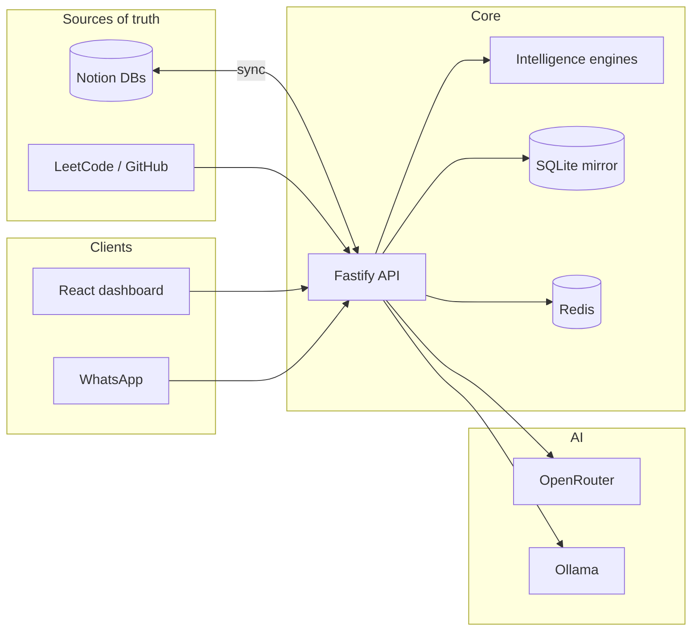

# DSA Mastery OS

**Autonomous learning intelligence for data structures and algorithms** — built around your Notion workspace, a local SQLite mirror, and AI-assisted coaching.

DSA Mastery OS turns a personal Notion DSA setup into a study system that plans your day, tracks mastery, surfaces weaknesses, and coaches you through problems. It is designed for **one learner, one workspace, one machine** — not as a multi-tenant SaaS. There are no user accounts, no shared tenancy, and no per-user data partitioning by design.

---

## What it does

| Capability | Description |
|------------|-------------|
| **Daily planning** | Ranks topics with a composite priority engine and suggests concrete problems for today's session |
| **Session tracking** | Logs study time, outcomes, and mistakes; updates intelligence state and syncs back to Notion |
| **Spaced repetition** | SM-2 revision queue for topics that need reinforcement |
| **Weakness detection** | Multi-signal analysis of mistake patterns, stagnation, and confidence gaps |
| **Adaptive difficulty** | Recommends problem difficulty based on topic mastery and recent performance |
| **Roadmap enforcement** | DAG-based prerequisite graph with violation detection |
| **AI coaching** | Hints, session debriefs, and free-form chat via OpenRouter or local Ollama |
| **Analytics** | Streaks, mastery velocity, weakness trends, and difficulty breakdowns |
| **Web dashboard** | Today view, overview charts, knowledge graph, activity heatmap, live session timer, and coach chat |
| **WhatsApp bot** *(optional)* | `plan`, `done`, `hint`, `debrief`, and scheduled digests via Meta Cloud API |
| **External sync** *(optional)* | LeetCode profile stats and GitHub solution linking |

---

## Architecture



**Data flow:** Notion remains the canonical store for topics, problems, and sessions. The backend mirrors that data locally in SQLite for fast queries and offline intelligence. Session and problem updates flow back to Notion on a bidirectional sync cycle (BullMQ scheduler or manual trigger).

**Intelligence layer:** Five pure TypeScript engines (`@dsa/intelligence`) — topic priority, revision (SM-2), weakness, difficulty, and roadmap — are orchestrated without I/O. The backend feeds them snapshot data and persists the results.

---

## Tech stack

| Layer | Technologies |
|-------|--------------|
| Monorepo | pnpm workspaces, TypeScript 5, ESLint, Vitest |
| API | Fastify, BullMQ, Pino |
| Database | SQLite + Drizzle ORM |
| Cache / jobs | Redis |
| Integrations | Notion API, Meta WhatsApp Cloud API, LeetCode GraphQL |
| AI | OpenRouter (default) or Ollama |
| Frontend | React 19, Vite, D3.js |
| Infrastructure | Docker Compose (Redis, Ollama), optional nginx |

---

## Prerequisites

- **Node.js** ≥ 20 and **pnpm** 9 (`corepack enable`)
- **Docker** (for Redis and Ollama)
- A **Notion** integration token and three database IDs (topics, problems, sessions)
- *(Optional)* OpenRouter API key, Meta WhatsApp app credentials, LeetCode username, GitHub token

---

## Quick start

### One command (recommended)

From a cold machine to studying:

```bash
pnpm setup          # first time only — .env, install, build
# Edit .env with your Notion credentials, then:
pnpm study          # Docker + API + dashboard + sync + open browser
```

Stop study mode with `pnpm study:stop`.

### Manual setup

```bash
pnpm setup
# Fill in infrastructure/.env.example values in .env

pnpm docker:up      # Redis + Ollama
pnpm dev:all        # API on :3000, dashboard on :5173
pnpm db:seed        # optional — initial Notion → SQLite sync
```

Open **http://localhost:5173** for the dashboard. In development the frontend talks to the API at `http://127.0.0.1:3000` (see `packages/frontend/.env.development`). Do not serve `packages/frontend/dist/` with a static file server alone — it has no API proxy and will fail with JSON parse errors.

### Health check

```bash
curl http://localhost:3000/health
# or
bash infrastructure/scripts/health-check.sh
```

Returns overall status plus per-service checks (SQLite, Redis, Notion, LLM).

---

## Configuration

Copy `infrastructure/.env.example` to `.env` at the repo root (or run `pnpm setup`). Key groups:

| Group | Variables | Purpose |
|-------|-----------|---------|
| Notion | `NOTION_TOKEN`, `NOTION_*_DB_ID` | Source databases |
| LLM | `LLM_PROVIDER`, `OPENROUTER_*`, `OLLAMA_*` | Coaching, hints, debriefs |
| WhatsApp | `WHATSAPP_*`, `WHATSAPP_NOTIFY_SECRET` | Bot commands and cron notifications |
| Intelligence | `WEIGHT_*` | Topic priority scoring weights |
| Schedulers | `ENABLE_SCHEDULERS`, `*_CRON`, `SCHEDULER_TIMEZONE` | BullMQ jobs (plan, sync, digest) |
| External | `LEETCODE_USERNAME`, `GITHUB_*` | Profile stats and solution linking |

OpenRouter is used when `OPENROUTER_API_KEY` is set unless `LLM_PROVIDER=ollama`. Scheduler-based WhatsApp notifications and n8n workflows overlap — enable one path, not both, unless you want duplicate messages.

WhatsApp setup details: [workflows/WHATSAPP_SETUP.md](workflows/WHATSAPP_SETUP.md).

---

## Project structure

```
dsa-mastery-os/
├── infrastructure/       # Docker Compose, nginx, setup & study scripts
├── database/             # Drizzle schema, SQL migrations
├── packages/
│   ├── backend/          # Fastify REST API, schedulers, services
│   ├── intelligence/     # Pure TS engines + orchestrator
│   ├── integrations/     # Notion, WhatsApp, LeetCode, LLM clients
│   ├── frontend/         # React + Vite dashboard
│   └── shared/           # Shared types and utilities
├── workflows/            # Optional n8n workflow exports
└── data/sqlite/          # Local SQLite mirror (gitignored)
```

---

## Development

```bash
pnpm dev              # API only (hot reload)
pnpm dev:web          # Dashboard only
pnpm dev:all          # API + dashboard in parallel

pnpm build            # Build all packages
pnpm test             # Run all Vitest suites
pnpm lint             # ESLint across packages

# Package-scoped
pnpm --filter @dsa/intelligence test
pnpm --filter @dsa/backend test
pnpm --filter @dsa/integrations db:seed
```

### Docker profiles

```bash
pnpm docker:up                              # Redis + Ollama (default)
docker compose -f infrastructure/docker-compose.yml --profile n8n up -d   # + n8n
docker compose -f infrastructure/docker-compose.yml --profile full up -d  # + containerized backend
```

### Production

Build the frontend, serve static assets and proxy `/api` through nginx using `infrastructure/nginx/nginx.conf`. Set `VITE_API_BASE_URL` empty for same-origin requests behind the proxy.

---

## API overview

All routes are prefixed with `/api` unless noted.

| Area | Examples |
|------|----------|
| Plan & topics | `GET /api/plan/today`, `GET /api/topics`, `GET /api/topics/:id/score/explain` |
| Sessions | `POST /api/session`, `GET /api/session/activity` |
| Problems & revision | `GET /api/problems`, `GET /api/revision` |
| Coaching | `GET /api/coaching/hint`, `GET /api/coaching/debrief`, `POST /api/coaching/chat` |
| Analytics | `GET /api/analytics/summary`, `/streak`, `/mastery-velocity`, `/weakness-trend`, `/difficulty` |
| Sync | `POST /api/sync`, `GET /api/sync/status`, `GET /api/sync/conflicts` |
| Integrations | `GET /api/integrations/leetcode/stats`, `POST /api/sync/github` |
| WhatsApp | `GET\|POST /webhooks/whatsapp` |
| Health | `GET /health`, `/health/live`, `/health/ready` |

Live dashboard updates use `GET /api/events` (SSE).

---

## CI

GitHub Actions runs on push and pull requests to `main` / `master`: install → build → lint → test.

---

## License

Private project — all rights reserved unless otherwise specified by the repository owner.
