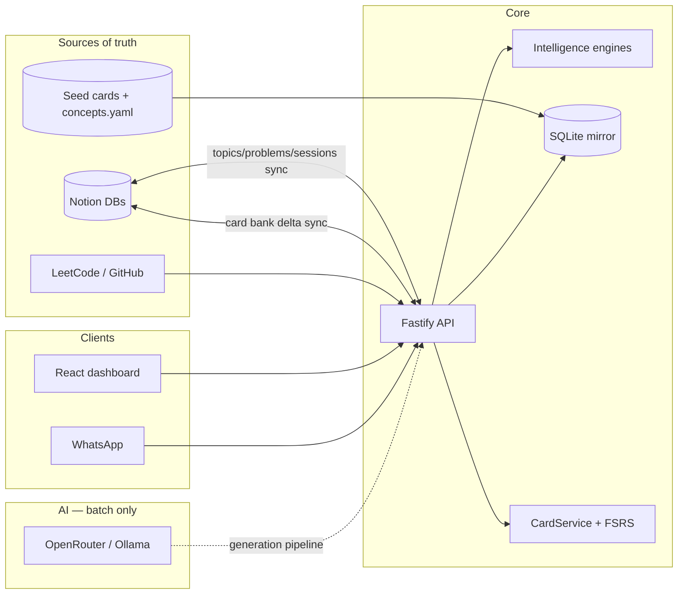

# DSA Mastery OS

**Autonomous learning intelligence for data structures and algorithms** — built around your Notion workspace, a local SQLite mirror, and AI-assisted coaching.

DSA Mastery OS turns a personal Notion DSA setup into a study system that plans your day, tracks mastery, surfaces weaknesses, and coaches you through problems. It is designed for **one learner, one workspace, one machine** — not as a multi-tenant SaaS. There are no user accounts, no shared tenancy, and no per-user data partitioning by design.

---

## What it does

| Capability | Description |
|------------|-------------|
| **Daily planning** | Ranks topics with a composite priority engine and suggests concrete problems for today's session |
| **Session tracking** | Logs study time, outcomes, and mistakes; updates intelligence state and syncs back to Notion |
| **Warm-up flashcards** | 3 local due cards before you solve — instant reveal, no LLM on the hot path, per-card FSRS |
| **Flashcard review** | Optional Review tab — interleaved due cards across all topics, hard daily cap, inline triage |
| **Card bank** | Seeded baseline + batch LLM generation from notes; closed concept vocabulary; semantic dedup |
| **Topic revision queue** | SM-2 revision queue for topics that need reinforcement (legacy intelligence path) |
| **Problem re-solve queue** | Per-problem spaced repetition — solves that showed struggle signals get scheduled for full re-solves (FSRS) |
| **Weakness detection** | Multi-signal analysis of mistake patterns, stagnation, and confidence gaps |
| **Adaptive difficulty** | Recommends problem difficulty based on topic mastery and recent performance |
| **Roadmap enforcement** | DAG-based prerequisite graph with violation detection |
| **AI coaching** | Hints, session debriefs, and free-form chat via OpenRouter (off the flashcard hot path) |
| **Analytics** | Streaks, mastery velocity, weakness trends, and difficulty breakdowns |
| **Web dashboard** | Today view, overview charts, knowledge graph, activity heatmap, live session timer, coach chat, Review tab |
| **WhatsApp bot** *(optional)* | `plan`, `done`, `hint`, `debrief`, and scheduled digests via Meta Cloud API |
| **External sync** *(optional)* | LeetCode profile stats and GitHub solution linking |

---

## Architecture



**Data flow:** Notion remains the canonical store for topics, problems, sessions, and (optionally) the flashcard bank. The backend mirrors that data locally in SQLite for fast queries and offline intelligence. Session and problem updates flow back to Notion on a sync cycle; card reviews write to SQLite first and flush to Notion (or a local JSON export) in the background.

**Two scheduling models (intentional):**
- **Per-card FSRS** (`ts-fsrs`) drives warm-up and the Review tab — each flashcard has its own stability, difficulty, and due date.
- **Topic-level SM-2** (`RevisionEngine`) still powers the revision queue and session analytics — separate from the flashcard bank.

**Intelligence layer:** Pure TypeScript engines (`@dsa/intelligence`) — topic priority, revision (SM-2), weakness, difficulty, roadmap, curriculum, and problem re-solve — plus analytics, all orchestrated without I/O. The backend feeds them snapshot data and persists the results.

**Design docs:** flashcard system in `docs/flashcard-system-design.md`; problem re-solve in `docs/problem-spaced-repetition-design.md`; architecture decisions in `docs/adr/`.

---

## Tech stack

| Layer | Technologies |
|-------|--------------|
| Monorepo | pnpm workspaces, TypeScript 5, ESLint, Vitest |
| API | Fastify |
| Database | SQLite + Drizzle ORM |
| Flashcards | `ts-fsrs`, local embeddings (Ollama / transformers.js) |
| Cache / jobs | In-process TTL cache + node-cron (weekly digest only) |
| Integrations | Notion API, Meta WhatsApp Cloud API, LeetCode GraphQL |
| AI | OpenRouter (coaching); Ollama + OpenRouter fallback (batch card generation) |
| Frontend | React 19, Vite, D3.js |
| Infrastructure | optional Docker Compose (n8n), optional nginx |

---

## Prerequisites

- **Node.js** ≥ 20 and **pnpm** 9 (`corepack enable`)
- A **Notion** integration token and three database IDs (topics, problems, sessions)
- **OpenRouter** API key for AI coaching
- *(Optional)* Notion card bank database ID, Ollama for local generation/embeddings, Docker (n8n add-on), Meta WhatsApp app credentials, LeetCode username, GitHub token

---

## Quick start

### One command (recommended)

From a cold machine to studying:

```bash
pnpm setup          # first time only — .env, install, build
# Edit .env with your Notion credentials, then:
pnpm study          # API + dashboard + sync + open browser
```

Stop study mode with `pnpm study:stop`.

### Manual setup

```bash
pnpm setup
# Fill in infrastructure/.env.example values in .env

pnpm dev:all        # API on :3000, dashboard on :5173
pnpm db:seed        # optional — initial Notion → SQLite sync
pnpm db:seed-cards  # optional — load seed flashcards into SQLite
```

Open **http://localhost:5173** for the dashboard. In development the frontend talks to the API at `http://127.0.0.1:3000` (see `packages/frontend/.env.development`). Do not serve `packages/frontend/dist/` with a static file server alone — it has no API proxy and will fail with JSON parse errors.

### Health check

```bash
curl http://localhost:3000/health
# or
bash infrastructure/scripts/health-check.sh
```

Returns overall status plus per-service checks (SQLite, Notion, LLM) and sync health (pending topic/problem edits + dirty card count).

---

## Configuration

Copy `infrastructure/.env.example` to `.env` at the repo root (or run `pnpm setup`). Key groups:

| Group | Variables | Purpose |
|-------|-----------|---------|
| Notion | `NOTION_TOKEN`, `NOTION_*_DB_ID` | Topics, problems, sessions databases |
| Card bank | `NOTION_CARDS_DB_ID`, `CARDS_EXPORT_DIR`, `CARDS_SYNC_FLUSH_INTERVAL_MS` | Card sync to Notion (or local JSON export fallback) |
| LLM | `OPENROUTER_*`, `COACH_LLM_MODEL` | Coaching, hints, debriefs; batch generation uses Ollama-first chain |
| Embeddings | `EMBEDDING_PROVIDER` | Local Ollama (`nomic-embed-text`) or transformers.js |
| WhatsApp | `WHATSAPP_*`, `WHATSAPP_NOTIFY_SECRET` | Bot commands and cron notifications |
| Intelligence | `WEIGHT_*` | Topic priority scoring weights |
| Schedulers | `ENABLE_SCHEDULERS`, `WEEKLY_DIGEST_CRON`, `SCHEDULER_TIMEZONE` | In-process cron (weekly digest only) |
| External | `LEETCODE_USERNAME`, `GITHUB_*` | Profile stats and solution linking |

Set `OPENROUTER_API_KEY` (and optionally `OPENROUTER_COACH_API_KEY` / `COACH_LLM_MODEL`) for AI coaching. Scheduler-based WhatsApp notifications and n8n workflows overlap — enable one path, not both, unless you want duplicate messages.

WhatsApp setup details: [workflows/WHATSAPP_SETUP.md](workflows/WHATSAPP_SETUP.md).

---

## Project structure

```
dsa-mastery-os/
├── infrastructure/       # Docker Compose, nginx, setup & study scripts
├── database/             # Drizzle schema, SQL migrations, seed cards
│   └── seeds/            # concepts.yaml + cards.yaml per topic
├── docs/                 # Flashcard design, teaching strategy, ADRs
├── packages/
│   ├── backend/          # Fastify REST API, CardService, schedulers
│   ├── intelligence/     # Pure TS engines + orchestrator
│   ├── integrations/     # Notion, sync, generation, embeddings, LLM
│   ├── frontend/         # React + Vite dashboard (Today, Review, Coach, …)
│   └── shared/           # Shared types and config
├── workflows/            # Optional n8n workflow exports
└── data/sqlite/          # Local SQLite mirror (gitignored)
```

---

## Development

```bash
pnpm dev              # API only (hot reload)
pnpm dev:web          # Dashboard only
pnpm dev:all          # API + dashboard in parallel

pnpm build            # Build all packages
pnpm test             # Run all Vitest suites
pnpm lint             # ESLint across packages

# Card bank
pnpm db:seed-cards    # Load seed cards from database/seeds
pnpm db:embed-cards   # Compute local embedding vectors
pnpm db:generate-cards # Run batch generation for dirty topics

# Package-scoped
pnpm --filter @dsa/intelligence test
pnpm --filter @dsa/backend test
pnpm --filter @dsa/integrations db:seed
```

### Docker profiles

The default dev flow needs no Docker — the cache and scheduler run in-process. Docker is only for optional add-ons:

```bash
docker compose -f infrastructure/docker-compose.yml --profile n8n up -d   # n8n
docker compose -f infrastructure/docker-compose.yml --profile full up -d  # containerized backend
```

### Production

Build the frontend, serve static assets and proxy `/api` through nginx using `infrastructure/nginx/nginx.conf`. Set `VITE_API_BASE_URL` empty for same-origin requests behind the proxy.

---

## API overview

All routes are prefixed with `/api` unless noted.

| Area | Examples |
|------|----------|
| Plan & topics | `GET /api/plan/today`, `GET /api/topics`, `GET /api/topics/:id/score/explain` |
| Sessions | `POST /api/session`, `GET /api/session/activity` |
| Warm-up | `GET /api/warmup/:topicId`, `POST /api/warmup/grade` |
| Flashcard review | `GET /api/review/queue`, `POST /api/review/grade`, `PATCH\|DELETE /api/review/:cardId` |
| Problems & revision | `GET /api/problems`, `GET /api/revision` |
| Re-solve | `GET /api/resolve/queue`, `POST /api/resolve/:problemId/complete\|skip\|admit` |
| Coaching | `GET /api/coaching/hint`, `GET /api/coaching/debrief`, `POST /api/coaching/chat` |
| Analytics | `GET /api/analytics/summary`, `/streak`, `/mastery-velocity`, `/weakness-trend`, `/difficulty` |
| Sync | `POST /api/sync`, `POST /api/sync/flush`, `GET /api/sync/status`, `GET /api/sync/conflicts` |
| Card sync | `POST /api/sync/cards/flush`, `GET /api/sync/cards/status`, `POST /api/sync/cards/pull` |
| Integrations | `GET /api/integrations/leetcode/stats`, `POST /api/sync/github` |
| WhatsApp | `GET\|POST /webhooks/whatsapp` |
| Health | `GET /health`, `/health/live`, `/health/ready` |

Live dashboard updates use `GET /api/events` (SSE).

---

## CI

GitHub Actions runs on push and pull requests to `main` / `master`: install → build → lint → test.

---

## Personalization

The coach's per-learner configuration lives in `docs/learner-profile.md`, which is
gitignored. Copy `docs/learner-profile.example.md` and fill it in.

---

## License

[MIT](LICENSE) © 2026 Hasanth Kumar Majji
